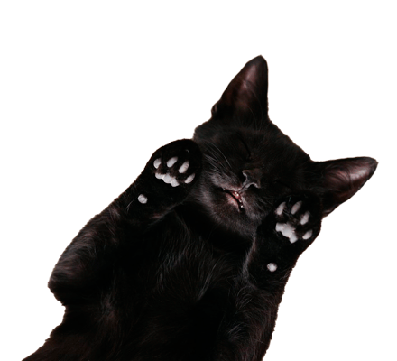

<html>
<head>
<link rel="stylesheet" href="css/estilo examen.css">
</head>
<body>
  <audio id="ronroneo" >
    <source src="audio/prrr.mp3" type="audio/mpeg">
  </audio>

  <button id="prrr" onclick="feliz()">Has encontrado a tu minino</button>

<button id="volver" onclick="inicio()">volver a jugar</button>
          

</body>
</html>
